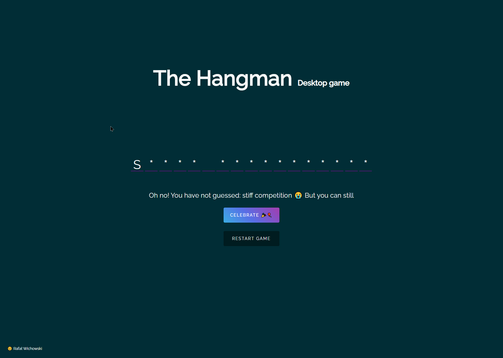

<p align="center">
  <a href="https://github.com/rawic/hangman-game">
    
  </a>

  <h3 align="center">The Hangman</h3>

  <p align="center">
    Simple hangman game. <a href="https://rawic.github.io/hangman-game/" target="_blank" rel="noopener noreferrer">Live</a>
    <br />
    Play at least once 😎
  </p>
</p>

## About The Hangman

<a align="center" href="https://rawic.github.io/hangman-game/" rel="nofollow noopener noreferrer" target="blank">
  
</a>

Simple hangman game with some fancy stuff

### Installation

```sh
npm install
npm run dev-server
```
### Built With

- JavaScript

## License

Distributed under the MIT License. See `LICENSE` for more information.

## Contact

Rafał Wichowski - [@rafalwichowski](https://twitter.com/rafalwichowski) - [hi@rawic.me](mailto:hi@rawic.me)

Project Link: [https://github.com/rawic/hangman-game](https://github.com/rawic/hangman-game)

[app-screenshot]: readme/app-screenshot.jpg
